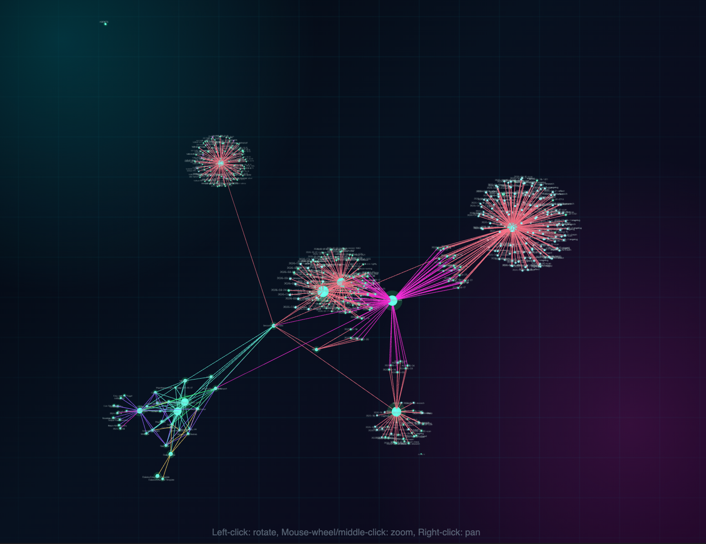

# Cipher Graph View

A futuristic neon 3D graph view for Obsidian vaults.



## Features

- Custom Obsidian view: **Cipher Graph**
- 3D force graph for all Markdown notes in the vault
- Neon nodes colored by folder/cluster
- Green glowing highlights for recently edited notes
- Directional particles on links
- Click a node to open the note
- Auto-refresh on vault changes

## Installation

### Manual

1. Copy `main.js`, `manifest.json`, and `styles.css` into your vault's plugin folder:
   `{vault}/.obsidian/plugins/cipher-graph-view/`
2. In Obsidian, go to **Settings → Community plugins**.
3. Disable **Restricted mode** if needed.
4. Reload plugins and enable **Cipher Graph View**.
5. Click the network icon in the ribbon or run `Open Cipher Graph` from the command palette.

## Usage

- **Click a node** to open the note
- **Drag** to rotate, **scroll** to zoom

## Development

```bash
npm install
npm run build  # production build
npm run dev    # watch mode
```

## License

[MIT](LICENSE)

## Credits

Built with [3d-force-graph](https://github.com/vasturiano/3d-force-graph), [Three.js](https://threejs.org/), and [three-spritetext](https://github.com/vasturiano/three-spritetext).
